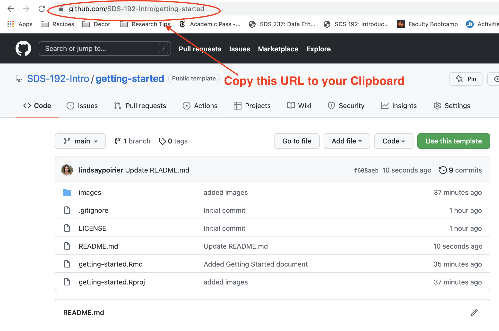
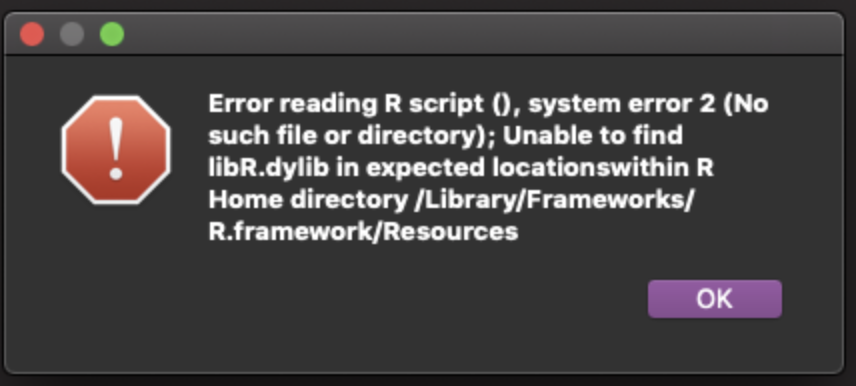
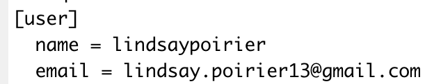

# Getting Started

> I'm going to start off by saying that I dread this day every time I teach R in a course. Students have different computers, sometimes have older versions of software installed on them, and different levels of experience setting up coding environments. I'll also admit that as a former CS undergrad, for me, the absolute hugest barrier to getting started on any project was getting my coding environment set up. We **are** going to run into frustrations today; it's inevitable. I'm going to do whatever I can to support you through them, which is why I'm carving out class time to do it. I don't expect every issue we run into to be sorted out by the end of class or even by class on Monday. I'm telling you this because I don't want you to worry if you run into roadblocks in setting up in your environment. *We will get through them.*

> On the other hand, some of you might breeze through this, having certain components already set up or having previous experience configuring GitHub. While not required, if you finish early and would be willing to help me troubleshoot other issues that come up, it would certainly be appreciated. Feel free to meet me back in the main meeting room when you're done if so. 

Below are instructions for setting up our course environment. It's important that you follow them in order and do exactly as is described in the videos. Today, you will be in break-out rooms, but feel free to work independently. If you have any questions, first ask the other students in your breakout room. I ask that you take this step as I will be managing about 20 different rooms at once. If you can't answer the question this way, call me into the breakout room. 

**Don't worry if you don't know what certain terms mean at this point. We will be going over things like the difference between R and RStudio, what a package is, what it means to commit code, and what a markdown file is a little later in the semester.** I just believe it will be easier to follow along with me in learning those things if you can follow along on your own computers. That's why we're taking this step to get things up and running so earlier in the semester. 

1. Follow the instructions in [chapter 4](https://happygitwithr.com/github-acct.html) of *Happy Git and GitHub for the useR* to create a GitHub account. If you already have a GitHub account, skip this step. 
2. Follow [these instructions](https://rstudio-education.github.io/hopr/starting.html) to download and install R and RStudio. Be sure to install R first and RStudio second. If you've already installed both, skip this step. 
3. Open RStudio.

**CONGRATULATIONS! You've installed all of the software needed for this course. Now onto configuration.** 

4. Follow instructions in this video to ensure git is installed: 

<p><a href="https://vimeo.com/511798611">Verify Git Installation</a> from <a href="https://vimeo.com/user95475944">David Keyes</a> on <a href="https://vimeo.com">Vimeo</a>.</p>

5. If git is not installed, leave your break-out room and come talk to me.
6. In the last step you clicked the 'Terminal' tab at the bottom of your screen. Go to that same section of your screen and click the 'Console' tab.
7. If you are configuring git for the first time (most of you will be), copy and paste the following into your console:

```
install.packages("usethis")
library(usethis)
```
After you've entered this, you should copy and paste the following into your console, replacing USERNAMEHERE with your GitHub username and EMAILHERE with your GitHub email:

```
use_git_config(user.name = "USERNAMEHERE", user.email = "EMAILHERE")
```

8. If you've configured git on your computer before, you can edit your git config by following these instructions: 

<p><a href="https://vimeo.com/511798861">Edit gitconfig file</a> from <a href="https://vimeo.com/user95475944">David Keyes</a> on <a href="https://vimeo.com">Vimeo</a>.</p>

9. Create a personal access token in GitHub by following these instructions. **Set the expiration date to 120 days from now**: 

<p><a href="https://vimeo.com/511801645">Create a Personal Access Token (PAT) on GitHub</a> from <a href="https://vimeo.com/user95475944">David Keyes</a> on <a href="https://vimeo.com">Vimeo</a>.</p>

10. Store your personal access token by following these instructions: 

<p><a href="https://vimeo.com/511803103">Store Personal Access Token to Connect RStudio and GitHub</a> from <a href="https://vimeo.com/user95475944">David Keyes</a> on <a href="https://vimeo.com">Vimeo</a>.</p>

**CONGRATULATIONS! You've configured GitHub to connect with RStudio! Now onto assignment submission practice.** 

11. In Moodle, scroll to the bottom of our course page to find the Getting Started Assignment link. Click this link to enter our GitHub classroom. This will copy a GitHub template repo into your GitHub account. It might take a few moments. 
12. Once the repo is created, copy the link to the repo that was just created to your clipboard. It should look something like https://github.com/SDS-192-Intro/getting-started/YOUR-USER-NAME



13. Create a project in RStudio from this GitHub repo by following the instructions starting at 26 seconds of this video:

<p><a href="https://vimeo.com/511804881">How to Connect RStudio Projects with GitHub Repositories: GitHub First</a> from <a href="https://vimeo.com/user95475944">David Keyes</a> on <a href="https://vimeo.com">Vimeo</a>.</p>

14. Install the rmarkdown package in RStudio by entering the following lines of code in the Console Pane of RStudio (lower left hand corner on initial install).  

```
install.packages("rmarkdown")
library(rmarkdown)
```


15. On the initial install, the Files tab will be in the lower right hand corner of RStudio. Open the getting-started.Rmd file. Follow instructions in the file. 
16. When the file tells you to commit your code, follow the instructions in this video starting at 14 seconds: 

<p><a href="https://vimeo.com/511800674">Make a Commit and View More History</a> from <a href="https://vimeo.com/user95475944">David Keyes</a> on <a href="https://vimeo.com">Vimeo</a>.</p>

17. Push your code to GitHub.com by following the instructions in this video starting at 27 seconds:

<p><a href="https://vimeo.com/511805399">General Workflow: Push</a> from <a href="https://vimeo.com/user95475944">David Keyes</a> on <a href="https://vimeo.com">Vimeo</a>.</p>


**CONGRATULATIONS! You've completed our course infrastructure set-up!** 

---
## Troubleshooting Common Issues

Here I will list common issues that folks faced at different steps of getting our course infrastructure set-up and how they fixed them:

### Step 3

#### Every time I try to open RStudio, I'm being prompted to reinstall RStudio.

This was happening for a few students on Windows machines. The reason is that you are clicking the file to install/RStudio, rather than the file to open the application. See if you can find the icon for RStudio when you open C:/ProgramFiles. The icon should look like this:


#### I'm seeing this image when I try to open RStudio:



This means that you likely installed RStudio but not R. Check back in on the instructions in Step 2 to make sure that you install R **and** RStudio. 

#### When I try to open RStudio, I’m not seeing the screen that appears in David Keyes's video in step 4. 

You are probably trying to open R rather than RStudio. Make sure you click on this icon:


…and not this one:


### Step 4

#### When I type in `which git`, I'm getting an error message that says that 'which' is not recognized. 

David Keyes was recording this video on a Mac. If which is not recognized, it's likely because you are on a Windows machine. Try typing `where git` instead of `which git`. 

### Step 5

#### I don’t have git installed. 

You should follow the steps here to install git: https://happygitwithr.com/install-git.html
Be sure to follow the instructions for your specific operating system. After you're done you can confirm that it’s installed by typing:

`where git` into the Terminal if you are on Windows
`which git` into the Terminal if you are on MacOS

### Step 7

#### I’m getting an error message when trying to install the "usethis" package. 

Try copying and pasting the `install.packages("usethis")` code into your console first and click enter. You will be asked "Do you want to install from sources the packages which need compilation? (Yes/no/cancel)", and you can type 'yes'. After that, a bunch of lines of code will run with red font. Once this is done, copy and paste the `library(usethis)` line into your Console and click enter. 

#### I’m getting an error message that rlang is not installed. 

In your console type `install.packages("rlang")`. Then re-try Step 7. 

#### I'm getting the following error when I try to set my git credentials:

```
Error in new_git_error("git_error", args = args, stdout = out, status = attr(out,  :
  System git failed: xcrun: error: invalid active developer path (/Library/Developer/CommandLineTools), missing xcrun at: /Library/Developer/CommandLineTools/usr/bin/xcrun
```
  
Switch to the Terminal tab in the bottom left hand corner of RStudio and enter the following:

`xcode-select --install`

Then try again. 

### Step 7/10, etc. 

#### I'm getting an error message that RStudio can't find Git.

Following the instructions at this link: https://happygitwithr.com/rstudio-see-git to tell RStudio where to find git. 

### Step 10

I'm getting the following error:

```
Error in new_git_error("git_error", args = args, stdout = out, status = attr(out,  :
  System git failed: fatal: bad config line ...
```

This means that you probably added some unrecognized characters in your git config file. 
Enter:

```
library(usethis)
edit_git_config
```

This will open your config file. Check to make sure you don't have extra quotation marks in your user name or email address. It should look something like this. 



### Step 13

#### When I try to create a new project, I'm getting the error:

```
remote: Support for password authentication was removed on August 13, 2021. Please use a personal access token instead.
```

This means that you likely set up some git credentials on your computer in the past. GitHub used to identify you by a password, but now they use the special token you generated in an earlier step. To fix this, you can enter the following into your console:

```
install.packages("gitcreds")
library(gitcreds)
gitcreds_set()
```
You'll see the following message:

```
1: Keep these credentials
2: Replace these credentials
3: See the password / token
```

Click 2. Then enter the personal access token you created in step 9. You should be able to create a project after this. 


